
<h4> [AI611] Deep Reinforcement Learning - Final Report</h4>
<h1>Safety Aware UAV Navigation in Adverse Environments</h1>
<h4>Kasper Joergensen (20246358) & Ozan Günes (20225389)</h4>

---

Visit the [online version](https://github.com/ozan-guenes/Quadcopter_gym/tree/main) of this report on GitHub.

## Project Motivation

The motivation behind this project comes from the difficulties of using reinforcement learning (RL) for drone navigation in real-world settings. Traditional drone control methods, like PID controllers, struggle when dealing with disturbances or obstacles in the environment. Reinforcement learning, especially for continuous control tasks, has the potential to autonomously adapt and improve drone navigation.

**Challenges with Existing Methods**
One of the main issues with current methods is how they handle disturbances. Many RL approaches have a hard time dealing with unexpected changes, which can negatively impact performance and reliability. Another challenge is ensuring safety in RL, as safety measures are still not fully developed, which is a big concern for real-world applications. For example, when training a real drone to fly, we would not want the drone to collide during either training or inference, as this could make the training process very costly and inefficient.

**Potential applications**
This research has a lot of potential applications. Drones could be used for search-and-rescue missions in tough terrains, where their ability to adjust to changing conditions is essential. They could also be useful for delivery services in urban environments, where navigating through dense buildings and avoiding obstacles is a challenge.

**Our project**
In our project, we begin by applying RL in a drone simulation environment without any disturbances. The plan was to first get a functioning RL agent in this initial, disturbance-free environment, and then gradually introduce disturbances and obstacles later on. However, learning the drone to fly and navigate turned out to be more challenging than expected, so we focus only on our efforts to train the drone for navigation. The later developments in safe RL are left for future work.

## Simulation Environment 

In this project, we used a drone simulation environment based on standard quadcopter dynamics, defined by ordinary differential equations. These dynamics were derived from _Quadcopter Dynamics, Simulation, and Control_ by Andrew Gibiansky and _Quadrotor Dynamics and Control_ by Randal Beard. We implemented these dynamics using a codebase from [this GitHub repository](https://github.com/abhijitmajumdar/Quadcopter_simulator), which includes a PID controller for quadcopter control and navigation.

**State and Action Spaces**
The drone's state is represented by a 12-dimensional vector that includes position \([x, y, z]\), linear velocities, angular orientations \([\theta, \phi, \psi]\), and angular rates. The action space consists of thrust forces from the four motors, each ranging from 4000 to 9000 units, simulating realistic motor inputs. To enable reinforcement learning, we extended the state space by adding a goal position and a goal yaw orientation, forming a 16-dimensional state vector that represents both the drone's current state and its target state.

    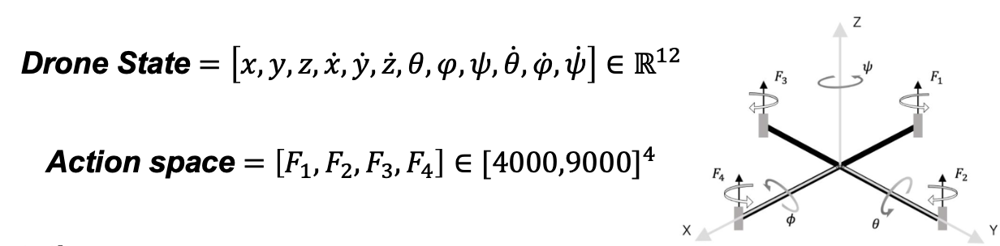

    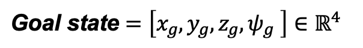

**Simulating Episodes**
Each simulation episode begins by randomly sampling the drone's initial and goal states. The task is for the drone to navigate to the target, at which point a new goal is generated.

## Reward Function Design

We quickly experienced that designing an effective reward function was very important for this RL task. The reward function needed to balance competing objectives to encourage desired drone behaviors. Key components of the reward function were:

- **Distance minimization**: Encouraging the drone to reduce its distance to the target.
- **Environment safety**: Penalizing collisions and staying within the predefined bounds of the environment.
- **Flight stability**: Discouraging high velocities and angular rates to promote smooth, controlled, and safe movement.

The reward function was composed of weighted terms that accounted for these aspects of good drone behavior. Positive contributions included time spent in the air, reduction in distance to the target, orientation stability, and a bonus for successfully reaching the target. Negative contributions included boundary violations, instability (such as high angular velocities), and excessive motor usage.

We tested various combinations of these weighted parameters to determine a set of weights (\(\alpha\)) that could help the drone learn to safely fly and navigate. However, tuning these weights was quite challenging as there were many parameters, and it took a long time to test a single set of parameters due to the long RL training time. Below is the formulation of the reward function we initially used:

    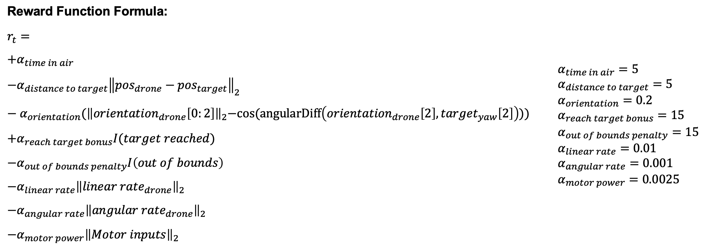

## Challenges in Training RL Agent: Tested RL Methods

We ran into some issues when training the RL agent for point-to-point navigation, so we decided to try out different RL algorithms to figure out what was going wrong.

- **Custom DDPG Implementation**:
  We implemented the DDPG algorithm from scratch, following the original paper ("Continuous control with deep reinforcement" by Timothy P. Lillicrap et al.). Unfortunately, the results weren’t great, and we started to question if there were any issues with our implementation.

- **Proven Algorithms**:
  We also tested some more established algorithms like TD3, SAC, and PPO to see how they compared. These performed a little better, but still didn’t quite reach the level we were hoping for.

Next, we’ll give a quick overview of the algorithms we tried and show the results we got. First, we compared the performance between DDPG and TD3 in the current environment, but this led to weak performance. After that, we tested SAC and PPO in a simplified learning environment with a re-designed reward function. While this approach gave us better results, they still weren’t satisfying. The reason for the weak results is not clear to us, despite trying a lot of debugging. We would need more time to find the root of the problem.

## DDPG vs. TD3: Key Differences

Deep Deterministic Policy Gradient (DDPG) is a model-free, off-policy, actor-critic algorithm designed for continuous action spaces. But, it can have some stability and robustness issues that affect performance. Twin Delayed Deep Deterministic Policy Gradient (TD3) was developed to tackle these problems with a few key improvements:

- **Overestimation Bias**  
  DDPG uses a single Q-network, which can suffer from overestimation due to noise and errors in value predictions. TD3 improves on this by using two Q-networks and Double Q-learning to take the minimum Q-value, which helps reduce overestimation bias and makes the learning process more stable.

- **Action Noise for Exploration**  
  In DDPG, we add noise (using an Ornstein-Uhlenbeck process) directly to the actions to promote exploration. But this can cause instability, especially in environments with steep value gradients. TD3 addresses this by adding noise to the target actions instead, which makes the updates smoother and more stable.

- **Delayed Policy Updates**  
  DDPG updates both the actor and critic at every training step, which can introduce a lot of variance into the learning process. TD3 delays policy updates, updating the actor less frequently (we update every two critic updates). This helps stabilize training and improve overall performance.

Below, you'll find the pseudocode for both algorithms.

|                                                             DDPG                                                             |                                                                    TD3                                                                    |
| :--------------------------------------------------------------------------------------------------------------------------: | :---------------------------------------------------------------------------------------------------------------------------------------: |
| 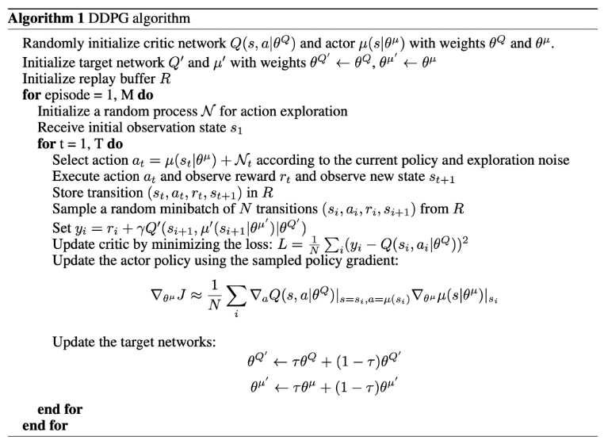<small> From "Continuous control with deep reinforcement" by Timothy P. Lillicrap et al. </small> | 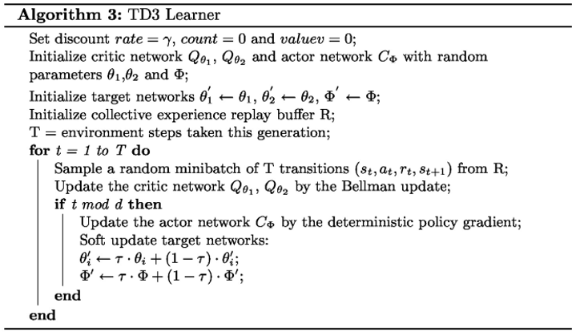<small> Algorithm based on DDPG see [TD3](https://spinningup.openai.com/en/latest/algorithms/td3.html) </small> |

## Performance Comparison: DDPG vs. TD3

The DDPG algorithm failed to converge to a meaningful policy during training, highlighting its inability to effectively navigate the quadcopter environment. The TD3 algorithm showed improvements over DDPG, but performance remained suboptimal.

When evaluating the trained agents from both methods over 100 episodes, the mean rewards and standard deviations were as follows:

- **DDPG**: Mean reward of \(-2091 \pm 1198\)
- **TD3**: Mean reward of \(-1588 \pm 837\)

Both algorithms exhibited high variance, and although TD3 outperformed DDPG, the results suggest that both approaches achieved suboptimal rewards. Qualitative simulations further revealed only slight improvements with TD3 over an untrained agent. Simulations of the untrained TD3 agent (left) and trained agent (right) are shown below, demonstrating the limited gains achieved.

|                 TD3 Untrained                 |                TD3 Trained                |          DDPG vs TD3 Comparison           |
| :-------------------------------------------: | :---------------------------------------: | :---------------------------------------: |
|  |  | 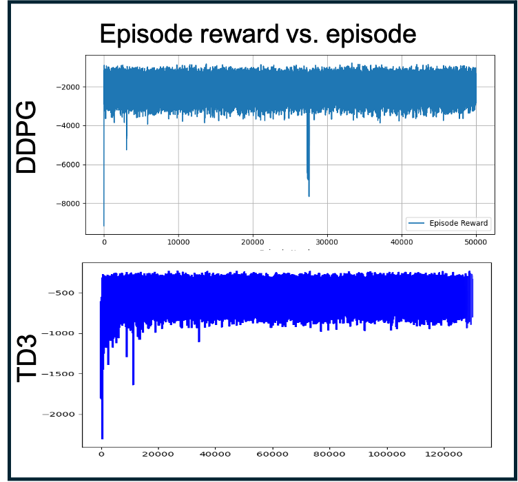 |

These findings indicate that while TD3 addressed some shortcomings, it still failed to deliver reliable drone navigation. To address this, we simplified the learning environment by fixing the drone's start and goal positions across all episodes, aiming to make the policy easier to learn. Additionally, we tested the SAC and PPO algorithms within this simplified environment to explore alternative approaches.

## Reward Function Re-Design

To get better results we re-designed the reward function starting from reward functions of proven papers​.

Again it proved difficult balancing the hyperparameters to encourage the desired bahavior.​

Here we basically penalized distance, orientation misalignment and control effort and promoted ​
being close to the target and reaching the target.

    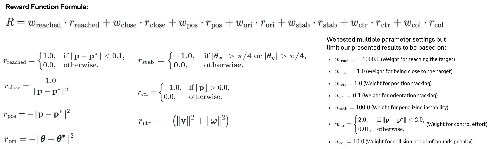

## SAC and PPO: Key Differences

### Soft Actor-Critic (SAC)

SAC is an **off-policy**, **model-free** algorithm. It maximizes a trade-off between expected reward and entropy, which encourages exploration. This is achieved through a stochastic policy and the use of twin Q-networks to stabilize training. SAC also uses a replay buffer to sample past experiences efficiently.

| **Strengths of SAC**                                                       | **Challenges of SAC**                                                                               |
| -------------------------------------------------------------------------- | --------------------------------------------------------------------------------------------------- |
| SAC is highly effective for continuous control tasks                       | SAC is computationally intensive because it trains twin Q-networks simultaneously.                  |
| It has strong exploration capabilities due to entropy maximization         | It requires careful fine-tuning of the entropy coefficient to balance exploration and exploitation. |
| It is computationally efficient compared to PPO, making it easier to scale |                                                                                                     |

### Proximal Policy Optimization (PPO)

PPO, on the other hand, is an **on-policy**, **model-free** algorithm. It optimizes a clipped surrogate objective, which prevents large, unstable updates to the policy. PPO uses single policy networks and avoids replay buffers, making it simpler and more stable.

| **Strengths of PPO**                                                       | **Challenges of PPO**                                                    |
| -------------------------------------------------------------------------- | ------------------------------------------------------------------------ |
| PPO is simpler to implement and produces more stable training results      | PPO is less sample-efficient compared to off-policy methods like SAC.    |
| It is suitable for environments with either discrete or continuous actions | It requires more interactions with the environment, which can be costly. |
| PPO is popular for training agents in large-scale distributed systems      |                                                                          |

 

| Feature            | SAC                                | PPO                        |
| ------------------ | ---------------------------------- | -------------------------- |
| Type               | off-policy                         | on-policy                  |
| Exploration        | strong (entropy driven)            | moderate                   |
| Sample Efficiency  | high (uses replay buffer)          | lower (needs more samples) |
| Training Stability | moderate (requires careful tuning) | high                       |
| Performance        | better for continuous control      | balanced for all tasks     |

## Performance Comparison: SAC and PPO

### Performance

|                                                                                                                                                                                                                                                                                                                                                                                                                                                                                                                                                                                                                                                                                                                   |                                                                                            |
| ----------------------------------------------------------------------------------------------------------------------------------------------------------------------------------------------------------------------------------------------------------------------------------------------------------------------------------------------------------------------------------------------------------------------------------------------------------------------------------------------------------------------------------------------------------------------------------------------------------------------------------------------------------------------------------------------------------------- | ------------------------------------------------------------------------------------------ |
| For SAC, the model converged to a stable reward around 400 episodes and did not improve further. This stability is due to SAC’s ability to balance exploration and exploitation through entropy maximization.  In contrast, the PPO model initially showed high variance in its reward curve. It took much longer—around 4200 episodes—before converging to a constant reward. This behavior reflects PPO's on-policy nature, which requires more interactions with the environment and makes exploration less efficient compared to SAC.   Looking at the mean episode rewards over 100 episodes, SAC achieved a mean reward of -912.46, while PPO slightly outperformed it with a mean reward of -895.14. | 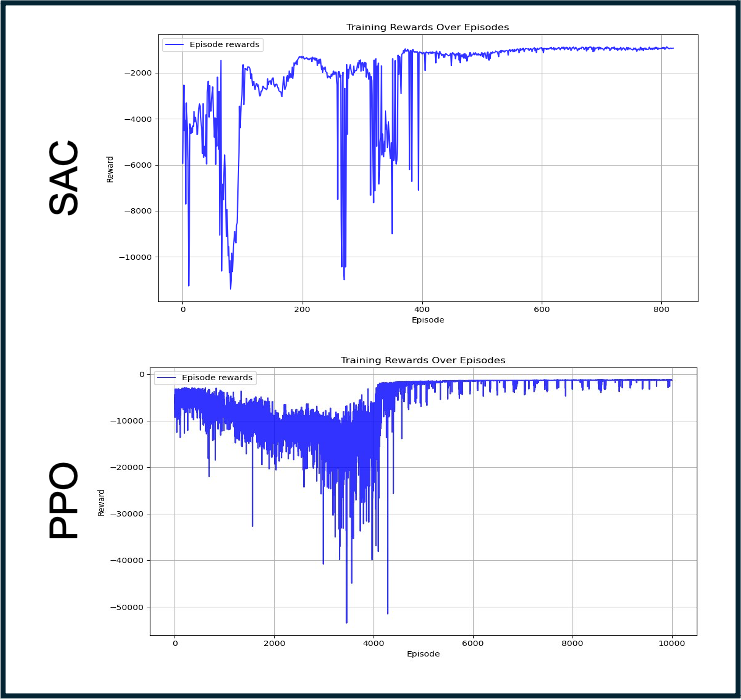 |

### Observations

For SAC, the untrained model struggled to stabilize the UAV, while the trained SAC model successfully stabilized its orientation but failed to converge to the target location. This indicates SAC’s stability in control but limited proximity accuracy.

For PPO, the trained model performed better. It aligned the UAV with the target and came closer to stabilizing within the target's proximity. Quantitatively, PPO demonstrated superior alignment and overall performance compared to SAC.

|         |                   Untrained                   |                   Moderately Trained                   |                  Trained                  |
| ------- | :-------------------------------------------: | :----------------------------------------------------: | :---------------------------------------: |
| **SAC** |  | 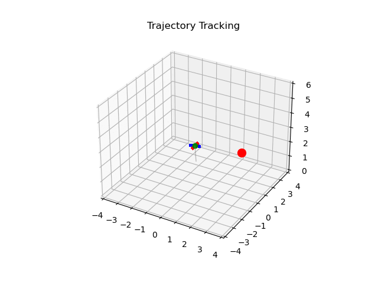 | 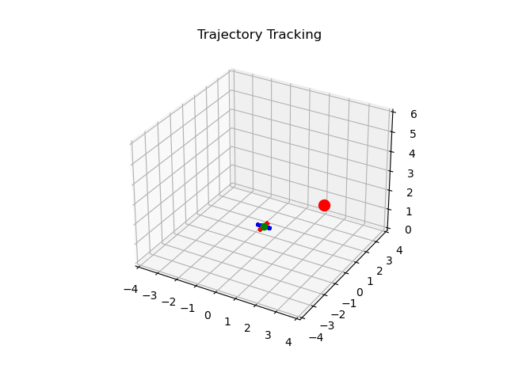 |
| **PPO** |  | 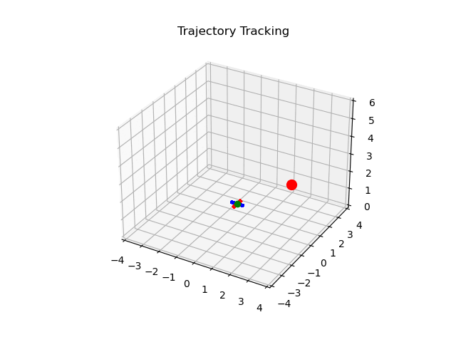 |  |

## Conclusions and Limitations

### Initial Goals:

The primary objective was to implement safety-aware reinforcement learning (RL) techniques for drone navigation.

### Challenges Faced:

- **Training Difficulties**: We encountered significant challenges in training the drone to learn basic navigation policies.
- **Limited Experience**: Our limited prior experience with practical RL training impacted productivity.
- **Environment and Reward Functions**: The creation of a custom environment and reward functions required substantial effort and hyperparameter tuning.
- **Policy Learning**: Learning a policy from scratch proved difficult, with no consistently successful outcomes.

### Future Directions:

- **Start Simpler**: The focus will shift to training the drone to hover before progressing to more complex point-to-point navigation.
- **Leverage Imitation Learning**: We plan to collect PID controller trajectories to guide the training process.
- **Reward and Environment Adjustments**: We hypothesize that careful adjustments to the reward function and environment could lead to better results with additional time and effort.

### Takeaway:

Despite the limited success, this project provided valuable hands-on experience in RL. We developed a custom quadcopter RL environment that can be utilized in future research on safety-aware drone navigation using RL.
